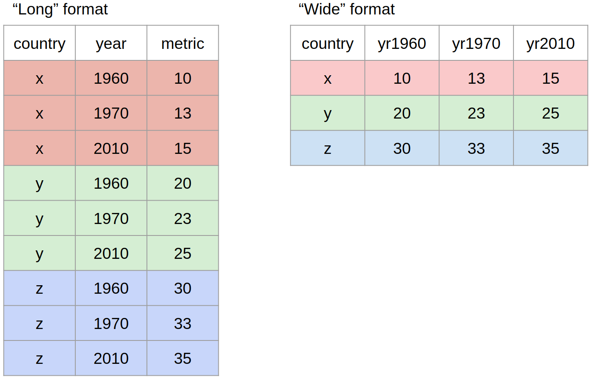
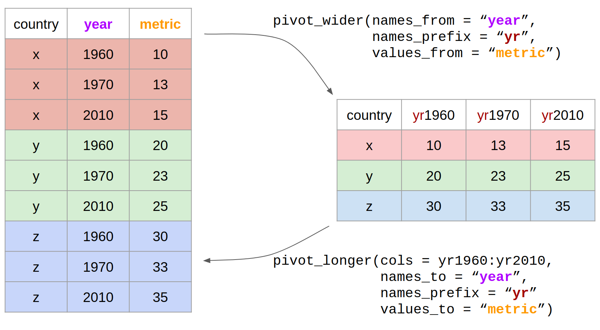

---
# Please do not edit this file directly; it is auto generated.
# Instead, please edit 08-reshaping.md in _episodes_rmd/
title: "Data reshaping: from wide to long and back"
teaching: 30
exercises: 20
questions:
- "How to change the shape of a table from a 'wide' to a 'long' format?"
- "When is one or the other format more suitable for analysis?"
objectives: 
- "Apply the `pivot_wider()` and `pivot_longer()` functions to reshape data frames."
- "Recognise some cases when using a wide or long format is desirable."
keypoints:
- "Use `pivot_wider()` to reshape a table from _long_ to _wide_ format."
- "Use `pivot_longer()` to reshape a table from _wide_ to _long_ format."
- "To figure out which data format is more suited for a given analysis, it can help to think about what visualisation you want to make with `ggplot`: any aesthetics needed to build the graph should exist as columns of your table."
source: Rmd
---

In this lesson we're going to learn how to use functions from the `tidyr` package 
(part of `tidyverse`) to help us change the shape of our data to suit our needs.

As usual when starting an analysis on a new script, let's start by loading the 
packages and reading the data. In this case, let's use the clean dataset that we 
created in the last exercise of a 
[previous episode]({{ page.root }}).

~~~
# load the package
library(tidyverse)

# Read the data, specifying how missing values are encoded
gapminder_clean <- read_csv("data/processed/gapminder1960to2010_socioeconomic_clean.csv", 
                            na = "")
~~~
{: .language-r}

If you haven't completed that exercise, here's how you can recreate the clean dataset:

~~~
gapminder_clean <- read_csv("data/raw/gapminder1960to2010_socioeconomic.csv", na = "") %>% 
  select(-country_id) %>% 
  mutate(population_total = population_male + population_female,
         main_religion = str_to_lower(str_squish(main_religion)),
         life_expectancy_male = ifelse(life_expectancy_male == -999, NA, life_expectancy_male),
         life_expectancy_female = as.numeric(life_expectancy_female)) %>% 
  filter(!is.na(income_groups))
~~~
{: .language-r}

## Data reshaping

What we mean by "the shape of our data" is how the values are distributed across rows or 
columns. Here's a visual representation of the same data in two different shapes:

- "Long" format is where we have a column for each of the types of things we measured 
  or recorded in our data. In other words, each _variable_ has its own column.
- "Wide" format occurs when we have data relating to the same measured thing in 
  different columns. In this case, we have values related to our "metric" spread 
  across multiple columns (a column each for a year). 
  
Neither of these formats is necessarily more correct than the other: it will depend 
on what analysis you intend on doing. 
However, it is worth mentioning that the "long" format is often preferred, as it 
is clearer how many distinct types of variables we have in the data. 

To figure out which format you might need, it may help to think of which visualisations 
you may want to build with `ggplot2`. Taking the above example:

- If one was interested in looking at the change of the "metric" across years for each country,
  then the long format is more suitable to define each _aesthetic_ of such a graph: 
  `aes(x = year, y = metric, colour = country)`.
- If one was interested in the _correlation_ of this metric between 1960 and 2010, then the 
  wide format would be more suitable: `aes(x = yr1960, y = yr2010, colour = country)`.

### Using the `pivot` functions

Let's look at how we can reshape our data in practice. There are two functions in the 
`tidyr` package (part of `tidyverse`) that can help us with this:

- `pivot_wider()`: from _long_ to _wide_ format.
- `pivot_longer()`: from _wide_ to _long_ format.

Here is the same picture with added code: 

Let's say we'd like to look at the correlation of `income_per_person` between 1960 and 
2010 across all the countries in our dataset. 
To achieve this, we will need to create a "wide" version of our table, where each row 
is a country and each column a year, with values of `income_per_person` in each cell 
of the table.

~~~
income_wide <- gapminder_clean %>% 
  # select only the columns we're interested in
  select(country, year, income_per_person) %>% 
  # use pivot_wider to go from long to wide format
  pivot_wider(names_from = "year", 
              names_prefix = "yr",
              values_from = "income_per_person")
income_wide
~~~
{: .language-r}

~~~
# A tibble: 192 x 52
   country yr1960 yr1961 yr1962 yr1963 yr1964 yr1965 yr1966 yr1967 yr1968 yr1969
   <chr>    <dbl>  <dbl>  <dbl>  <dbl>  <dbl>  <dbl>  <dbl>  <dbl>  <dbl>  <dbl>
 1 Afghan…   1213   1199   1195   1192   1190   1190   1176   1181   1196   1187
 2 Angola    3861   4311   4130   4278   4687   4964   5174   5393   5231   5300
 3 Albania   2792   2815   2908   3006   3107   3219   3337   3460   3581   3699
 4 Andorra  15234  16469  17805  19248  20809  22496  24320  26291  28422  30726
 5 United…   1767   1980   2219   2894   4917   8353  14190  24106  28964  34801
 6 Argent…   9025   9505   9191   8821   9586  10314  10226  10351  10652  11412
 7 Armenia   2517   2613   2639   2539   2826   2948   3055   3154   3304   3317
 8 Antigu…   4419   4527   4637   4749   4865   4983   5104   5228   5355   5485
 9 Austra…  14339  14119  14734  15350  16090  16593  16748  17561  18251  18938
10 Austria  12073  12634  12852  13280  13975  14275  14965  15298  15888  16823
# … with 182 more rows, and 41 more variables: yr1970 <dbl>, yr1971 <dbl>,
#   yr1972 <dbl>, yr1973 <dbl>, yr1974 <dbl>, yr1975 <dbl>, yr1976 <dbl>,
#   yr1977 <dbl>, yr1978 <dbl>, yr1979 <dbl>, yr1980 <dbl>, yr1981 <dbl>,
#   yr1982 <dbl>, yr1983 <dbl>, yr1984 <dbl>, yr1985 <dbl>, yr1986 <dbl>,
#   yr1987 <dbl>, yr1988 <dbl>, yr1989 <dbl>, yr1990 <dbl>, yr1991 <dbl>,
#   yr1992 <dbl>, yr1993 <dbl>, yr1994 <dbl>, yr1995 <dbl>, yr1996 <dbl>,
#   yr1997 <dbl>, yr1998 <dbl>, yr1999 <dbl>, yr2000 <dbl>, yr2001 <dbl>,
#   yr2002 <dbl>, yr2003 <dbl>, yr2004 <dbl>, yr2005 <dbl>, yr2006 <dbl>,
#   yr2007 <dbl>, yr2008 <dbl>, yr2009 <dbl>, yr2010 <dbl>
~~~
{: .output}

Note that the `names_prefix` argument is optional. Here, we've used it because it's a
good idea to avoid column names that start with a number. In other cases you can omit it.

Now, we could answer our question of interest:

~~~
income_wide %>% 
  ggplot(aes(yr1960, yr2010)) +
  geom_point() +
  geom_abline() +
  scale_x_continuous(trans = "log10") +
  scale_y_continuous(trans = "log10")
~~~
{: .language-r}

The oposite of this operation can be achieved with the `pivot_longer()` function. 
Let's reverse the reshaping we did above:

~~~
income_wide %>% 
  pivot_longer(cols = yr1960:yr2010,
               names_to = "year", 
               values_to = "income_per_person")
~~~
{: .language-r}

~~~
# A tibble: 9,792 x 3
   country     year   income_per_person
   <chr>       <chr>              <dbl>
 1 Afghanistan yr1960              1213
 2 Afghanistan yr1961              1199
 3 Afghanistan yr1962              1195
 4 Afghanistan yr1963              1192
 5 Afghanistan yr1964              1190
 6 Afghanistan yr1965              1190
 7 Afghanistan yr1966              1176
 8 Afghanistan yr1967              1181
 9 Afghanistan yr1968              1196
10 Afghanistan yr1969              1187
# … with 9,782 more rows
~~~
{: .output}

Note that the `cols` argument of `pivot_longer()` accepts column specifications in a 
similar way to the `select()` function discussed in an earlier episode. For example, 
in this case we could have also used `contains("yr")` to use all the columns containing 
the string "yr".

> ## Exercise
> 
> - Create a "wide" table of life expectancy values, with a row for each year and a column 
>   for each country.
> 
> - Fix the _pivoting_ step in the following code, which should allow making the graph
>   below.
>   
> 
> ~~~
> gapminder_clean %>% 
>   # retain data from a few years only
>   filter(year %in% c(1960, 1970, 1980, 1990, 2010)) %>% 
>   # select columns of interest
>   select(country, year, life_expectancy_female, life_expectancy_male) %>% 
>   # reshape the table
>   pivot_longer(cols = FIXME, 
>                names_to = "FIXME", 
>                values_to = "FIXME") %>% 
>   ggplot(aes(factor(year), life_expect)) +
>   geom_boxplot(aes(fill = sex))
> ~~~
> {: .language-r}
> 
> 
> 
> > ## Answer
> > 
> > 
> > ~~~
> > gapminder_clean %>% 
> >   select(country, year, life_expectancy) %>% 
> >   pivot_wider(names_from = "country", values_from = "life_expectancy")
> > ~~~
> > {: .language-r}
> > 
> > 
> > 
> > ~~~
> > # A tibble: 51 x 193
> >     year Afghanistan Angola Albania Andorra `United Arab Em… Argentina Armenia
> >    <dbl>       <dbl>  <dbl>   <dbl>   <dbl>            <dbl>     <dbl>   <dbl>
> >  1  1960        38.6   42.4    62.7      NA             55.0      64.1    62.0
> >  2  1961        39.4   43.0    63.7      NA             56.1      64.2    62.4
> >  3  1962        40.1   43.6    64.6      NA             57.2      64.2    62.7
> >  4  1963        40.8   44.3    65.3      NA             58.4      64.3    63.1
> >  5  1964        41.5   44.9    65.9      NA             59.4      64.4    63.5
> >  6  1965        42.2   45.5    66.3      NA             60.5      64.5    63.8
> >  7  1966        42.9   46.2    66.5      NA             61.6      64.6    64.2
> >  8  1967        43.7   46.8    66.7      NA             62.6      64.7    64.6
> >  9  1968        44.4   47.4    66.9      NA             63.5      64.9    64.9
> > 10  1969        45.1   48.1    67.1      NA             64.4      65.1    65.2
> > # … with 41 more rows, and 185 more variables: `Antigua and Barbuda` <dbl>,
> > #   Australia <dbl>, Austria <dbl>, Azerbaijan <dbl>, Burundi <dbl>,
> > #   Belgium <dbl>, Benin <dbl>, `Burkina Faso` <dbl>, Bangladesh <dbl>,
> > #   Bulgaria <dbl>, Bahrain <dbl>, Bahamas <dbl>, `Bosnia and
> > #   Herzegovina` <dbl>, Belarus <dbl>, Belize <dbl>, Bolivia <dbl>,
> > #   Brazil <dbl>, Barbados <dbl>, Brunei <dbl>, Bhutan <dbl>, Botswana <dbl>,
> > #   `Central African Republic` <dbl>, Canada <dbl>, Switzerland <dbl>,
> > #   Chile <dbl>, China <dbl>, `Cote d'Ivoire` <dbl>, Cameroon <dbl>, `Congo,
> > #   Dem. Rep.` <dbl>, `Congo, Rep.` <dbl>, Colombia <dbl>, Comoros <dbl>, `Cape
> > #   Verde` <dbl>, `Costa Rica` <dbl>, Cuba <dbl>, Cyprus <dbl>, `Czech
> > #   Republic` <dbl>, Germany <dbl>, Djibouti <dbl>, Dominica <dbl>,
> > #   Denmark <dbl>, `Dominican Republic` <dbl>, Algeria <dbl>, Ecuador <dbl>,
> > #   Egypt <dbl>, Eritrea <dbl>, Spain <dbl>, Estonia <dbl>, Ethiopia <dbl>,
> > #   Finland <dbl>, Fiji <dbl>, France <dbl>, `Micronesia, Fed. Sts.` <dbl>,
> > #   Gabon <dbl>, `United Kingdom` <dbl>, Georgia <dbl>, Ghana <dbl>,
> > #   Guinea <dbl>, Gambia <dbl>, `Guinea-Bissau` <dbl>, `Equatorial
> > #   Guinea` <dbl>, Greece <dbl>, Grenada <dbl>, Guatemala <dbl>, Guyana <dbl>,
> > #   Honduras <dbl>, Croatia <dbl>, Haiti <dbl>, Hungary <dbl>, Indonesia <dbl>,
> > #   India <dbl>, Ireland <dbl>, Iran <dbl>, Iraq <dbl>, Iceland <dbl>,
> > #   Israel <dbl>, Italy <dbl>, Jamaica <dbl>, Jordan <dbl>, Japan <dbl>,
> > #   Kazakhstan <dbl>, Kenya <dbl>, `Kyrgyz Republic` <dbl>, Cambodia <dbl>,
> > #   Kiribati <dbl>, `St. Kitts and Nevis` <dbl>, `South Korea` <dbl>,
> > #   Kuwait <dbl>, Lao <dbl>, Lebanon <dbl>, Liberia <dbl>, Libya <dbl>, `St.
> > #   Lucia` <dbl>, `Sri Lanka` <dbl>, Lesotho <dbl>, Lithuania <dbl>,
> > #   Luxembourg <dbl>, Latvia <dbl>, Morocco <dbl>, Monaco <dbl>, …
> > ~~~
> > {: .output}
> > 
> > 
> > 
> > ~~~
> > gapminder_clean %>% 
> >   filter(year %in% c(1960, 1970, 1980, 1990, 2010)) %>% 
> >   select(country, year, life_expectancy_female, life_expectancy_male) %>% 
> >   pivot_longer(cols = life_expectancy_female:life_expectancy_male, 
> >                names_to = "sex", values_to = "life_expect") %>% 
> >   ggplot(aes(factor(year), life_expect)) +
> >   geom_boxplot(aes(fill = sex))
> > ~~~
> > {: .language-r}
> > 
> > 
> {: .solution}
{: .challenge}
